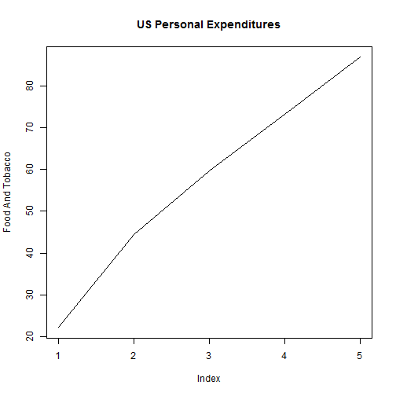

## Introduction

*The purpose of this shiny app is to add interactivity to the simple line graphs of US Personal Expenditures from the {datasets} package. By adding interactivity to these plots, the user will be more engaged with the data product, which will facilitate the desired knowledge transfer.*

--- 

## Basic Plot of US Personal Expenditures


```r
plot(USPersonalExpenditure[1, ], type="l", ylab="Food And Tobacco", main="US Personal Expenditures")
```

 

--- 

## Shiny App of US Personal Expenditures

[View Shiny App of US Personal Expenditures at shinyapps.io](https://mkirby.shinyapps.io/exampleShinyApp/)

---

## Conclusion

*After viewing the shiny app, one can easily see how interacting with a dynamic data product is much more engaging than viewing a static data product. As a result of the increased level of engagement from interactive data products, the data product user should be able to absorb the desired information more easily.*

